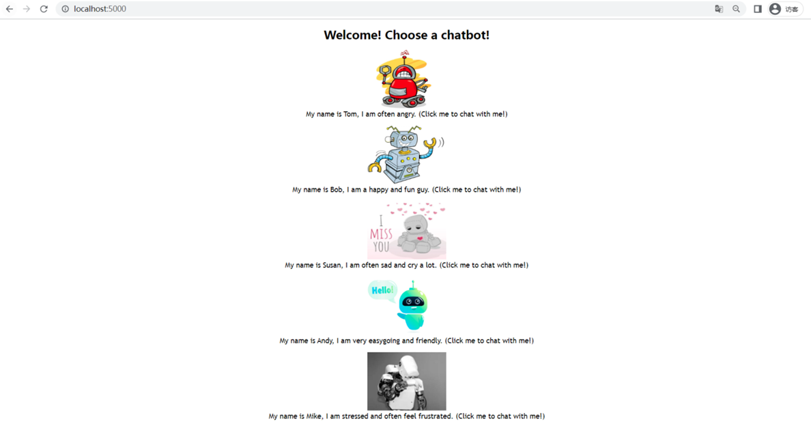
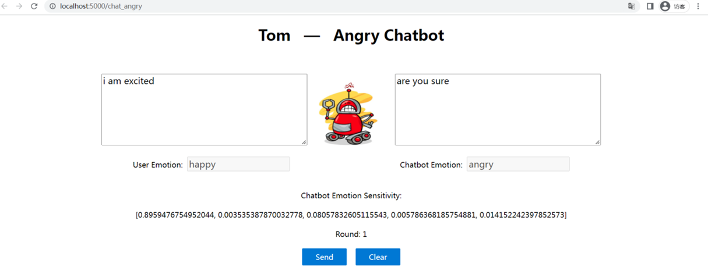

# Chatbots With Emotional Context

**This project contains 5 chatbots with different personalities (angry, sad, happy, neutral, frustrated) and strong emotional retention ability.**

Chatbots respond to user input based on their personality. During the chat, chatbots are able to maintain their mood well and recover to their personality at regular intervals.
  

The emotion recognition module uses Keras framework and bi-directional LSTM. The dialog generation module uses Keras framework, Seq2Seq model (encoder and decoder both use three-layer LSTM), and add emotional attention mechanism (concat emotion vector and decoder's input).
  

To run this project, clone this repository by using this:

`git lfs clone git@github.com:xsb1999/Chatbots-With-Emotional-Context.git`

This may take you a little longer because the project contains large model files (about 100 MB).

When the clone is complete, Run ***app.py*** and go to http://localhost:5000

 

If you want to build all the models by yourselves, run the scripts in the following order.

- Download the **IEMOCAP** dataset ([sail.usc.edu/iemocap/](https://sail.usc.edu/iemocap/))
- Modify the data location in ***preprocess.py***
- Run ***preprocess.py***
- Run ***build_vocab_train_test.py***
- Go to **emotion_recognition** folder, and run ***bulid_model.ipynb***
- Go to **create_QA_data** folder
	- Modify the data location in ***create_Q_A_data.ipynb***
	- Run ***create_Q_A_data.ipynb***
- Go to **dialogue_generation** folder
	- Run ***build_train_test_data.ipynb***
	- Run ***Seq2Seq.ipynb***
	- Run ***extract_encoder_decoder.ipynb***
- Finally, run ***app.py***

 

**Screenshots:**

 

